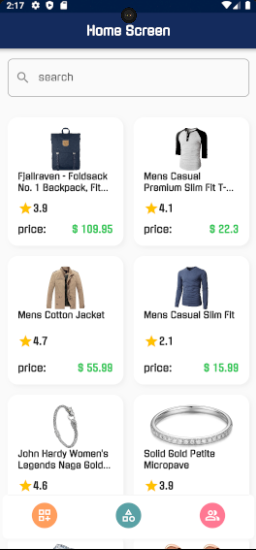
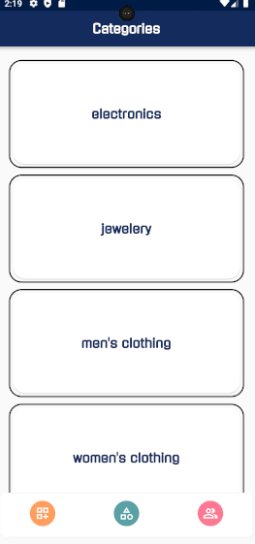

# Flutter BLoC Example

A Flutter project showcasing the BLoC (Business Logic Component) pattern for state management. The application includes a splash screen, home screen , categories screen , create product screen .

## API Dummy uses
* https://fakestoreapi.com/

## Home Screen

The Home Screen Shows all the available products without sorting 

## Categories Screen

The Categories screen shows what are the available categories in the shop

## Create Product Screen

The Create product Screen enables the user to add a new product ,all he needs to do is to capture or select an image ,add a name, add a description , select the category for the product and finally add a price.

## Getting Started
clone https://github.com/MLMAHAFZA/deltainformatics_FakeApiPractice.git

## Dependencies

The project uses the following dependencies:

- **equatable: ^2.0.5**
    - A package to simplify equality comparisons for Dart classes.
    - [equatable on pub.dev](https://pub.dev/packages/equatable)

- **lottie: ^2.7.0**
    - Lottie is a mobile library for Android and iOS that parses Adobe After Effects animations exported as json with Bodymovin and renders them natively on mobile!
    - [flutter_bloc on pub.dev](https://pub.dev/packages/lottie)

- **flutter_bloc: ^8.1.3**
  - The official state management solution for Flutter applications, based on the BLoC (Business Logic Component) pattern.
  - [flutter_bloc on pub.dev](https://pub.dev/packages/flutter_bloc)

- **cupertino_icons: ^1.0.2**
  - This is an asset repo containing the default set of icon assets used by Flutter's Cupertino widgets.
  - [flutter_bloc on pub.dev](https://pub.dev/packages/cupertino_icons)

- **image_picker: ^1.0.5**
  - A Flutter plugin for iOS and Android for picking images from the image library, and taking new pictures with the camera.
  - [flutter_bloc on pub.dev](https://pub.dev/packages/image_picker) 

- **http: ^1.1.2**
    - A package for making HTTP requests in Dart, used for network communication.
    - [http on pub.dev](https://pub.dev/packages/http)

- **get_storage: ^2.1.1**
    - A simple key-value storage library for Flutter, used for storing data persistently.
    - [get_storage on pub.dev](https://pub.dev/packages/get_storage)

- **flutter_launcher_icons: ^0.13.1**
    - A Flutter package for configuring custom app icons for both Android and iOS.
    - [flutter_launcher_icons on pub.dev](https://pub.dev/packages/flutter_launcher_icons)

Make sure to check the respective links to the documentation on pub.dev for each package for more information and usage instructions.
